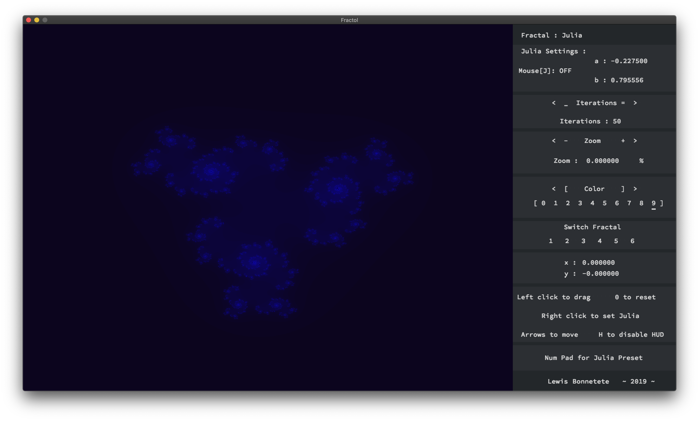
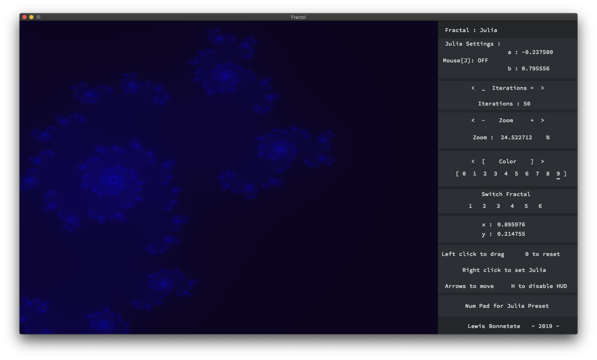
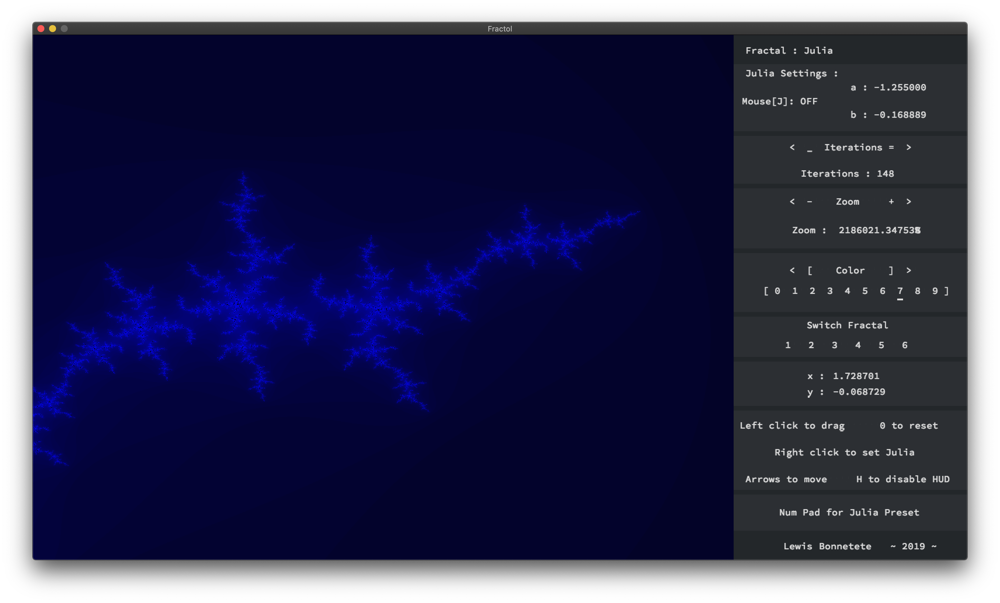
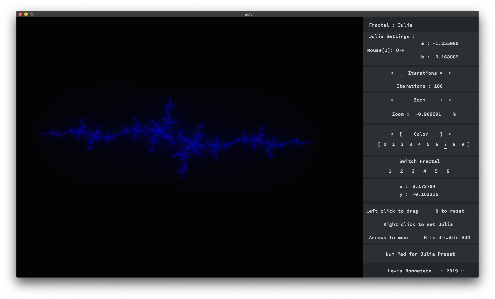
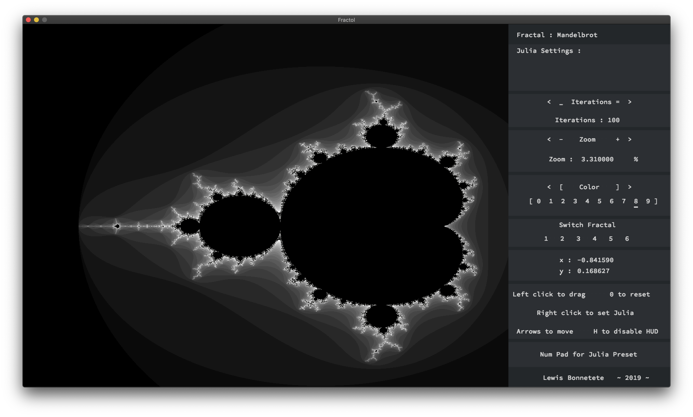
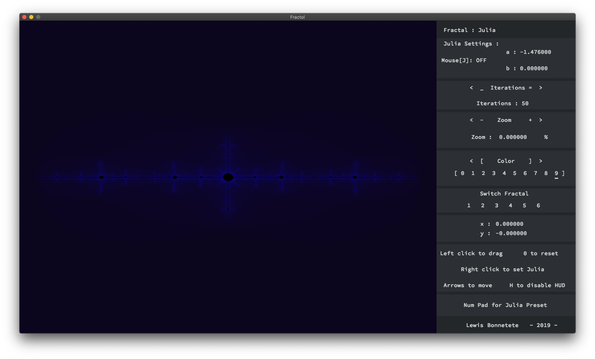

# Fractale

L'objectif était de réaliser un visualisateur de Fractale. Il a été nécessaire d'assimiler quelques notions de mathématiques concernant les nombres complexes et les suites, qui n'étaient pas nouvelles pour moi. Il a aussi fallut prendre en main une bibliothèque de programmation graphique, ici, celle de l'école 42.

Une fois le coeur du programme devellopé et les conditions du sujet respectées, j'ai essayé de construire une interface intuitive et d'améliorer l'ergonomie de mon visualisateur. C'est comme ça que j'ai réfléchie pour la première fois à l'UX Design et surtout que j'ai entrevue la complexité du domaine.

  

 1 | 2
-------------------------|-------------------------
  |  
  |  
  |  
